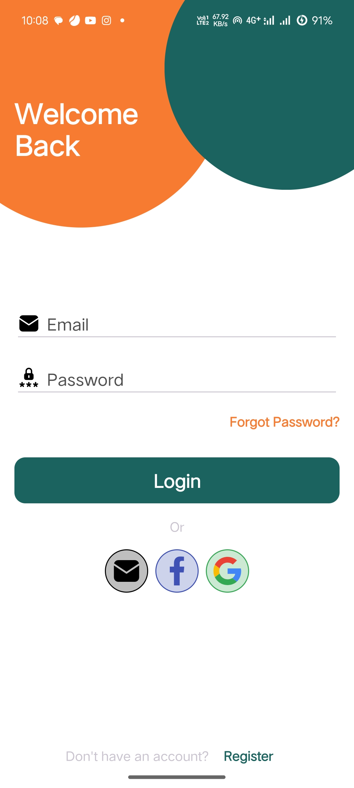
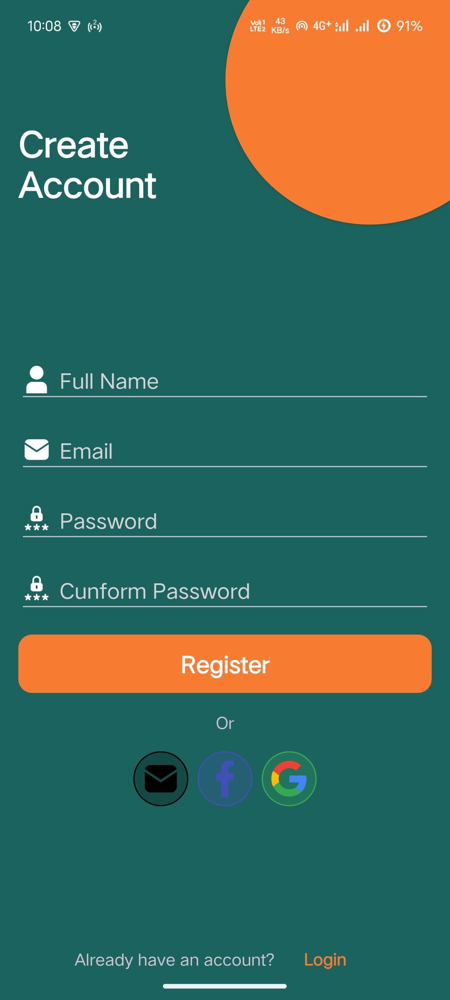

# Animation Auth Screen Design ✨

This project demonstrates a beautifully animated **Authentication Screen** built with **MotionLayout** in Android using Kotlin.

## 🚀 Features

- Login/Signup UI with smooth transitions
- Modern MotionLayout-based animations
- Clean and reusable component structure
- Fully responsive design
- Built using Jetpack libraries

## 📸 Screenshots

| Login | Animated Transition | Signup |
|-------|---------------------|--------|
|  |  |  |

> 💡 Add your screenshots in a `screenshots/` folder and link them here

## 🛠️ Tech Stack

- **Kotlin**
- **MotionLayout**
- **ConstraintLayout**
- **XML** 

## 📁 Project Structure

